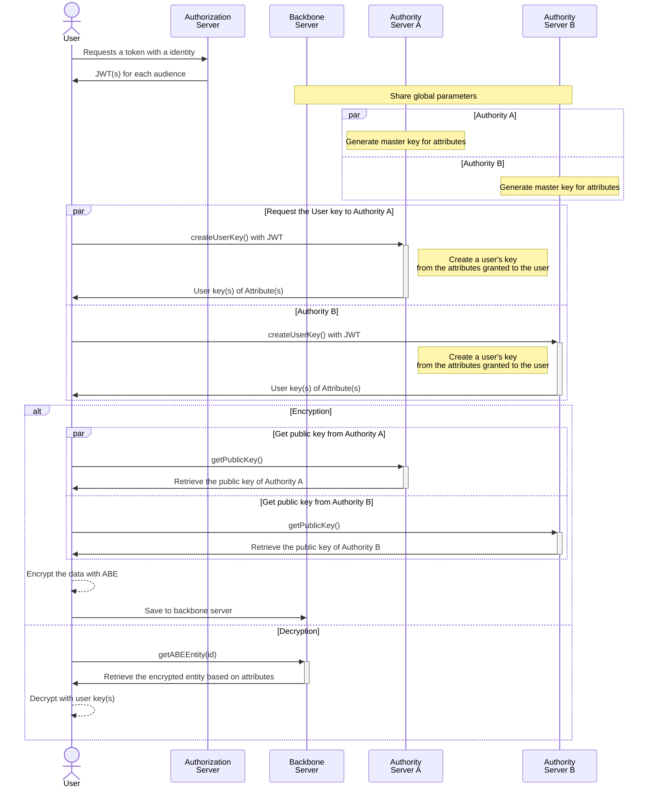

import Image from '@theme/IdealImage';
import overviewDiagram from './overview-diagram.png';

# Introduction

## The Problem
Traditionally, organizations have stored sensitive information and credentials in centralized systems, where a single server or service oversees access to secrets. While this centralized approach simplifies management, it introduces critical vulnerabilities. Chief among these is the **Single Point of Failure (SPOF)**, which can compromise the entire secret management infrastructure.
- **Insider Threats**: Central server administrators hold significant power over the secret management system. If they leak or misuse sensitive information, such as API keys or user credentials, they can compromise the entire security framework.
- **Vulnerability to External attacks**: An attacker who gains elevated privileges within the central system could gain access to all managed secrets, potentially causing catastrophic damage.
- **Limited Scalability**: As organizations grow, centralized systems often struggle to scale effectively. Scaling typically requires distributing physical servers, which increases infrastructure complexity and costs while potentially degrading usability and performance.
- **Lack of Data Owner Control**: Centralized secret management leaves access control in the hands of server administrators, limiting the control data owners have over permissions. This can result in security gaps, as owners are unable to tailor policies to specific needs and contexts.

## The Solution
Nebula, our open-source secret management system leveraging Multi-Authority Attribute-Based Encryption (MA-ABE), offers a robust alternative to centralized approaches by addressing the limitations and vulnerabilities.

- **Distributed Management**: By distributing the management of keys across multiple authorities, Nebula eliminates reliance on a single central system, thereby mitigating the risks associated with SPOF. This approach facilitates scalability without compromising security and system usability.
- **Flexible Access Control**: MA-ABE enables granular, attribute-based access controls for secure and customized permission management, tailored to organizational needs. This allows data owners to define and enforce access policies, without relying solely on central administrators.
- **Enhanced Security**: Secrets are stored in a distributed manner and protected using attribute-based encryption, ensuring they are inaccessible without the necessary attributes controlled by other authorities—even if one authority or backbone server is compromised. Additionally, the implementation of E2EE (End-to-End Encryption) further safeguards data by ensuring that encryption and decryption occur exclusively between authorized parties, reducing the risk of interception or unauthorized access during transmission and storage.

## What is Nebula?

<Image img={overviewDiagram} />

[Nebula](https://github.com/CremitHQ/nebula) is an open-source, scalable, secure, and decentralized secret management platform that leverages Multi-Authority Attribute-Based Encryption (MA-ABE) to address the limitations of centralized approaches. It supports diverse applications and use cases, providing a flexible solution for securely storing and managing access to sensitive information across various domains and organizations.

### Nebula's Goals

Provide a secure and decentralized secret management infrastructure for organizations and applications. This infrastructure aims to achieve the following goals:

   - **Enhance Security**: Eliminate centralized key management servers to reduce single points of failure and enhance overall system security.

   - **Distribute Authority**: Distribute authority across multiple entities to enhance security and minimize the impact of a compromised authority.

   - **Fine-Grained Access Control**: Leverage attribute-based policies for precise and flexible access control. So that organizations can define and enforce complex rules based on user roles and attributes.

   - **Flexible Authorization**: Support a variety of authentication/authorization protocols, including OIDC and SAML, allowing integration with existing identity and access management systems.

   - **Flexible Storage Options**: Nebula supports a variety of storage backends, including PostgreSQL, etcd, and file-based storage, allowing organizations to select the storage solution that best fits their specific requirements. This flexibility enables seamless scaling of the secret management infrastructure without being constrained by storage limitations.

   - **Auditable**: Provide detailed logs and audit trails to track access events, changes, and system activities, enabling organizations to meet compliance requirements by enhancing transparency and accountability.

   - **Advanced Secret Management Capabilities**: Features such as secret rotation and SSH secret engines are integrated through separate agents, allowing for automated and secure management of secrets. This ensures advanced features are isolated from core operations, maintaining system integrity and security.

## Architecture

## Acknowledgements

- [NIST: Overview and Considerations of Access Control Based on Attribute Encryption](https://csrc.nist.gov/pubs/ir/8450/ipd)
- [Decentralizing Attribute-Based Encryption](https://eprint.iacr.org/2010/351.pdf)
- [Multi-Authority Attribute Based Encryption](https://iacr.org/archive/tcc2007/43920514/43920514.pdf)
- [A Survey on Ciphertext-Policy Attribute-based Encryption (CP-ABE) Approaches to Data Security on Mobile Devices and its Application to IoT](https://dl.acm.org/doi/10.1145/3102304.3102338)
