import Image from '@theme/IdealImage';
import overviewDiagram from './overview-diagram.png';

# What is Nebula?

<Image img={overviewDiagram} />

[Nebula](https://github.com/CremitHQ/nebula) is a comprehensive platform for secret management, designed to support various applications and use cases. It provides a secure, scalable, and flexible solution for storing and controlling access to sensitive information across multiple domains and organizations.

- Multi-Authority Attribute-Based Encryption (MA-ABE) is the core cryptographic protocol used by Nebula to securely store and control access to secrets. It allows for fine-grained access control based on user attributes across multiple authorities.

- A key security feature of Nebula is its end-to-end encryption(E2EE) model. All encryption and decryption operations are performed on the client side, ensuring that sensitive data never leaves the client in an unencrypted form. This approach significantly enhances security by reducing the attack surface and eliminating the need to trust the server with unencrypted secrets.

- The Nebula protocol operates over a secure transport layer (e.g., TLS) that provides integrity, server authentication, confidentiality, and transport channel binding.

#### Nebula objectives

1. Provide a secure and decentralized secret management infrastructure for organizations and applications. This infrastructure aims to achieve the following qualities:

   - Enhanced Security: Eliminate the need for centralized key management servers, reducing the risk of single point of failure and improving overall system security.

   - Distributed Authority: Separate and distribute authority across multiple entities, enhancing security and reducing the potential impact of compromised authorities.

   - Fine-grained Access Control: Utilize attribute-based policies to enable precise control over secret access, allowing organizations to define and enforce complex access rules based on user attributes and roles.

   - Flexible Authentication: Support various authentication methods across different authorities, enabling organizations to use their preferred identity providers and authentication mechanisms.

   - Robust Validation: Validate client credentials against trusted third-party sources, similar to Vault's approach with Github, LDAP, AppRole, and others, ensuring the authenticity of access requests.

2. Offer a more secure and privacy-focused alternative to traditional centralized secret management solutions. Nebula aims to provide:

   - Improved security against potential compromises of individual authorities in the system.

   - Enhanced privacy through client-side encryption, ensuring that unencrypted secrets never leave the client.

3. Balance robust security measures with user experience, prioritizing ease of integration for developers and simplicity of use for end-users across various platforms and devices.

4. Provide a scalable and adaptable solution that can grow with organizations, supporting complex multi-domain and multi-organizational secret sharing scenarios while maintaining strict security standards.

#### Why Nebula?

TBD

## Techincal Details and Architecture

```mermaid
sequenceDiagram
    participant User
    participant BS as Backbone<br>Server
    participant ASA as Authority<br>Server A
    participant ASB as Authority<br>Server B

    Note over BS, ASB: Share global parameters
    par Authority A
        Note over ASA: Generate master key for attributes
    and Authority B
        Note over ASB: Generate master key for attributes
    end
    par Request the User key to Authority A
        User->>+ASA: createUserKey() with authentication
        Note right of  ASA: Create a user's key <br>from the attributes granted to the user
        ASA->>-User: User key(s) of Attribute(s)
    and Authority B
        User->>+ASB: createUserKey() with token
        Note left of  ASB: Create a user's key <br>from the attributes granted to the user
        ASB->>-User: User key(s) of Attribute(s)
    end

    loop Health check for Authority A
        ASA-->>BS: ping
    end
    loop Health check for Authority B
        ASB-->>BS: ping
    end
    alt Encryption
        par Get public key from Authority A
            User->>+ASA: getPublicKey()
            ASA->>-User: Retrieve the public key of Authority A
        and Get public key from Authority B
            User->>+ASB: getPublicKey()
            ASB->>-User: Retrieve the public key of Authority B
        end

        User->>User: Encrypt the data key with ABE
        User-->>BS: Save to backbone server

    else Decryption
        User->>+BS: getABEEntity(id)
        BS->>-User: Retrieve the encrypted entity based on attributes
        User->>User: Decrypt with user key
    end
```

TBD

## Acknowledgements

- [NIST: Overview and Considerations of Access Control Based on Attribute Encryption](https://csrc.nist.gov/pubs/ir/8450/ipd)
- [Decentralizing Attribute-Based Encryption](https://eprint.iacr.org/2010/351.pdf)
- [Multi-Authority Attribute Based Encryption](https://iacr.org/archive/tcc2007/43920514/43920514.pdf)
- [A Survey on Ciphertext-Policy Attribute-based Encryption (CP-ABE) Approaches to Data Security on Mobile Devices and its Application to IoT](https://dl.acm.org/doi/10.1145/3102304.3102338)
